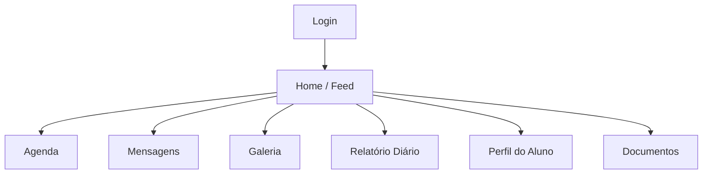

# Projeto QA – Aplicativo de Creche Educabiz

## Sobre o projeto

Este projeto tem como objetivo planejar, documentar e executar testes manuais no aplicativo Educabiz, simulando o trabalho realizado por um Analista de QA em um ambiente profissional.

Além da validação funcional da aplicação mobile, o projeto contempla a documentação dos testes, o registro de defeitos, a coleta de evidências e a organização das atividades utilizando ferramentas amplamente empregadas no mercado.

## Objetivos

* Mapear as principais funcionalidades do aplicativo.
* Definir o escopo dos testes.
* Elaborar casos de teste.
* Executar os testes manuais.
* Registrar bugs encontrados no Jira.
* Documentar evidências e resultados no GitHub.

## Ferramentas utilizadas

* Jira – gerenciamento de tarefas e registro de bugs.
* GitHub – versionamento e documentação do projeto.
* Excel ou Google Sheets – elaboração e execução dos casos de teste.
* Capturas de tela e gravações de vídeo – evidências dos testes.

## Escopo dos testes

### Módulos testados

1. Autenticação
2. Home / Feed
3. Perfil do aluno
4. Mensagens
5. Documentos
6. Relatório diário
7. Galeria
8. Agenda

## Mapa simplificado da aplicação

